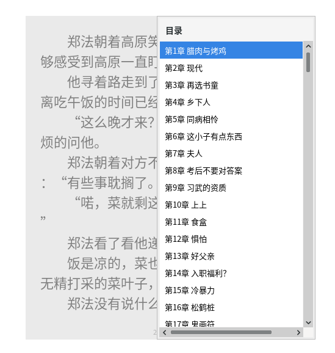

# gReader

跨平台 TXT 阅读器，Java 17 + Swing 实现。


## 功能


- **目录识别** — 内置中/英文标题正则，支持自定义，c 键切换悬浮面板开关目录
- **快捷键系统** — j/k 翻页 / Ctrl 跳转章节 / 鼠标按键和滚轮，全部可自定义
- **进度记忆** — 自动记住最后打开文件和页码，下次打开自动恢复
- **主题** — 内置 IDEA Dark 主题，可自定义字体颜色背景
- **透明度** — 窗口背景可半透明，文字始终保持不透明清晰
- **拖拽导入** — 拖动 txt 文件到窗口即可打开

*不透明显示*


*透明显示*


*目录面板*


## 运行

```bash
java -jar target/gReader-1.0.jar
# 或原生二进制
./target/gReader/bin/gReader
```

## 构建

```bash
bash build.sh                 # JAR
bash build-native.sh          # 原生含完整 JRE ~189MB
bash build-native-small.sh    # jlink 最小 JRE ~57MB
```

## 快捷键

| 键 | 功能 |
|----|------|
| j / Space / PgDn | 下一页 |
| k / PgUp | 上一页 |
| Ctrl + 翻页键 | 跳转章节 |
| c | 目录面板 |
| o | 边框切换 |
| Ctrl + 滚轮 | 背景透明度 |
| Ctrl + Alt + S | 打开设置 |
